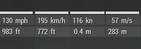

    

<strong>Requires the latest version of <a href="https://github.com/CBATeam/CBA_A3/releases/latest">CBA_A3</a></strong>

# Arma 3 Additional Measurements

Adds more speed and altitude units to Arma 3, decimal places has been added to altitudes below 10m / 10ft.

## Speed

* km/h
* mph
* kn
* m/s
* ft/s
* [fff (furlong–firkin–fortnight)](https://en.wikipedia.org/wiki/FFF_system)

## Altitude

* meters (m)
* feet (ft)
* yards (yd)
* [rod](https://simple.wikipedia.org/wiki/Rod_(unit))
* [au (astronomical unit)](https://simple.wikipedia.org/wiki/Astronomical_unit)

## Installation

* Subscribe via [Steam Workshop](https://steamcommunity.com/sharedfiles/filedetails/?id=1942567517)
* Download via [Github](https://github.com/synixebrett/A3AdditionalUnits/releases)
